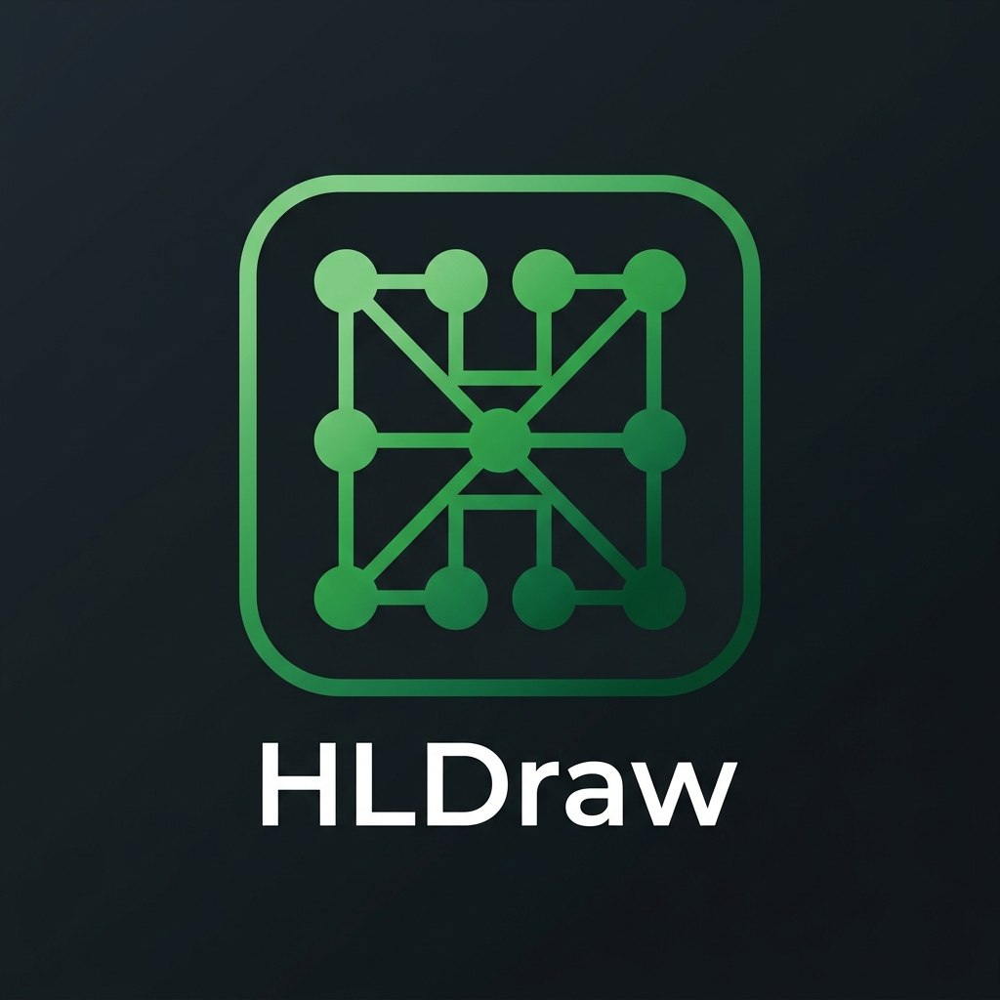

# HLDraw

<div align="center">
  

  **A Modern System Design and Architecture Diagramming Tool with Live Traffic Simulation**
</div>

## Overview

HLDraw is a powerful, Excalidraw-based system design and architecture diagramming platform. Beyond simple diagramming, HLDraw features a built-in traffic simulation engine that allows you to model request flows, visualize bottlenecks, and test horizontal autoscaling configurations directly on your canvas.

## Features

- **Intuitive Diagramming**: Built on Excalidraw for a familiar, fluid drawing experience.
- **Custom System Components**: Native components (Databases, Load Balancers, Queues, Clouds) specifically tailored for architecture design.
- **Live Traffic Simulation**: Define source RPS (Requests Per Second) and visualize load distribution across your entire architecture.
- **Horizontal Autoscaling**: Simulate adding replicas to components and watch how it affects load capacity in real-time.
- **Smart Magnetic Arrows**: Arrows intelligently snap and stick to components, even after deletions or movements.
- **Dark & Light Themes**: Fully supported theme customization that saves across sessions.

## Project Structure

This project is structured as a monorepo containing:

- `apps/web`: The Next.js frontend application, featuring the Excalidraw canvas and React-based UI.
- `apps/backend`: The Golang backend service, built with the Gin framework and PostgreSQL for persistent data storage.

## Installation & Setup

### Prerequisites

- Node.js (v18+)
- Go (v1.21+)
- PostgreSQL (for backend data storage)

### Steps

1. **Clone the repository:**
   ```bash
   git clone <repository-url>
   cd hldraw
   ```

2. **Install dependencies:**
   From the root of the project, run:
   ```bash
   npm install
   ```
   *This will install dependencies for all workspaces, including the frontend application.*

3. **Backend Setup:**
   Ensure your PostgreSQL instance is running. Configure your environment variables for the Golang backend (e.g., database credentials):
   ```bash
   cd apps/backend
   go mod download
   cd ../..
   ```

4. **Run the development servers:**
   You can start both the Next.js frontend and the Golang backend concurrently from the root directory:
   ```bash
   npm run dev
   ```
   
   Alternatively, you can run them individually:
   - **Frontend only:** `npm run dev:web`
   - **Backend only:** `npm run dev:backend`

5. **Access the application:**
   Open [http://localhost:3000](http://localhost:3000) in your browser to view the frontend.

## Contributing

We welcome contributions to HLDraw! To ensure a smooth process, please adhere to our project guidelines:

1. **Branching**: Use feature branches with descriptive names (e.g., `feat/add-new-node-type`, `fix/arrow-snapping-bug`).
2. **Commits**: Follow [Conventional Commits](https://www.conventionalcommits.org/en/v1.0.0/) format (e.g., `feat:`, `fix:`, `docs:`, `refactor:`).
3. **Coding Standards**: Ensure code is clean, modular, and adheres to our project's general principles (Single Responsibility Principle, explicit over implicit).
4. **Testing**: Write unit/E2E tests alongside any new logic, especially for simulation and scaling components.
5. **Pull Requests**: Open a pull request against the `main` branch, ensuring it is small, focused, and includes a clear description of the changes.

## License

This project is open-source and available under standard open-source licenses. Please refer to the repository files for specific licensing details.
